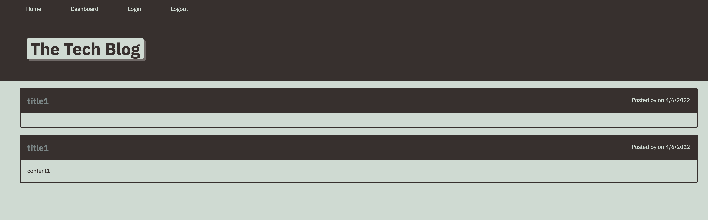
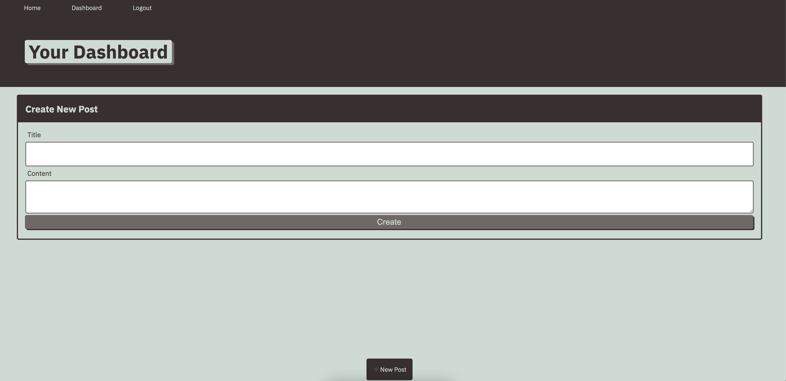

# MVC-Tech-Blog

## Description 
With this application, a user can sign up with a username and password. When logged in, the user can make thier blog posts and post comments.

## Table Of Contents
  * [Installation](#installation)
  * [Contributing](#contributing)
  * [Questions](#questions)

  ## Installation
  From the command line the user must run `npm i` the install the packages needed for this application.
  To run the server, from the command line type `npm start`

When server is started, before a user is logged in, they can see the blog posts, they cannot create their own until they are logged in.

## Usage
Once user is logged in, from the dashboard page, they can create a new post.

## Contributing 
Nick Broglio

 ## Questions 
  If you have any questions, contact me at:
  
  * Github: https://github.com/NickBroglio
  * Email: nickrbroglio@gmail.com